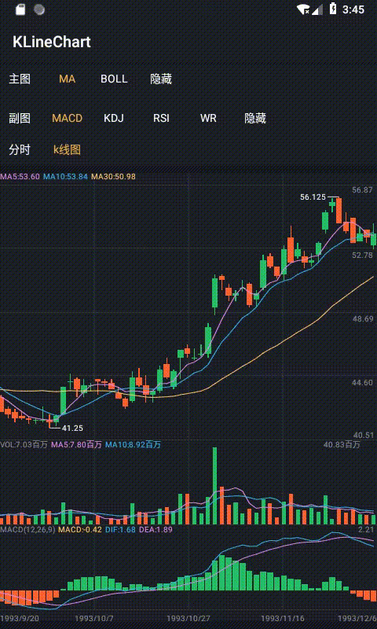
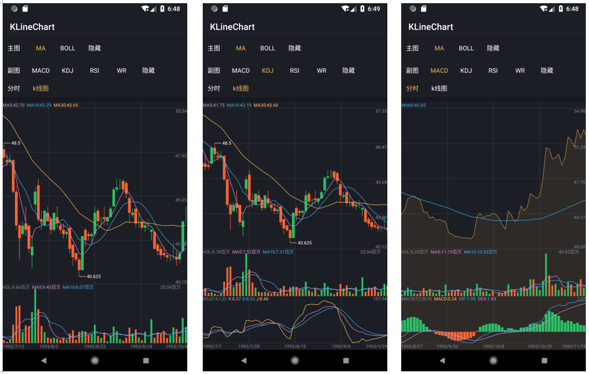

# KLineChart

[](https://jitpack.io/#QingDian-Fan/KlineProject)

Android K 线图组件与示例工程，支持蜡烛图、分时线、成交量、长按十字线、横向滑动、双指缩放，以及 `MA`、`BOLL`、`MACD`、`KDJ`、`RSI`、`WR` 等常见技术指标。


## 当前状态

- Gradle Wrapper：`7.2`
- Android Gradle Plugin：`7.1.0`
- Kotlin：`1.5.31`
- `compileSdkVersion` / `targetSdkVersion`：`32`
- `minSdkVersion`：`24`
- 示例应用已启用 ViewBinding。
- Demo 数据加载使用 `DataRequest.getData(context, offset, 500)`，每页加载 500 条。
- `KLineChartView` 已处理外层嵌套 `ScrollView/NestedScrollView` 时的横向滑动冲突。

## 模块说明

| 模块 | 说明 | 包名 |
| --- | --- | --- |
| `demo` | 示例 App，演示图表初始化、指标切换、分页加载、ViewBinding 使用 | `com.common.demo` |
| `lib-kline-chart` | K 线图组件库，核心控件为 `KLineChartView` | `com.common.kline` |

库模块的详细 API、样式属性和分页说明见 [lib-kline-chart/README.md](./lib-kline-chart/README.md)。

## 运行效果





## 接入指南
- Step 1. Add the JitPack repository to your build file

```groovy
	dependencyResolutionManagement {
		repositoriesMode.set(RepositoriesMode.FAIL_ON_PROJECT_REPOS)
		repositories {
			mavenCentral()
			maven { url 'https://jitpack.io' }
		}
	}
```

- Step 2. Add the dependency

```groovy
dependencies {
	        implementation 'com.github.QingDian-Fan:KlineProject:1.0.4'
	}
```


## 快速开始

在 `settings.gradle` 中包含模块：

```groovy
include ':demo', ':lib-kline-chart'
```

在 App 模块中依赖组件库：

```groovy
dependencies {
    implementation project(':lib-kline-chart')
}
```

在布局中添加图表控件：

```xml
<com.common.kline.KLineChartView
    android:id="@+id/kLineChartView"
    android:layout_width="match_parent"
    android:layout_height="450dp" />
```

在 Activity 中初始化：

```kotlin
private lateinit var binding: ActivityMainBinding
private val adapter by lazy { KLineChartAdapter() }

override fun onCreate(savedInstanceState: Bundle?) {
    super.onCreate(savedInstanceState)
    binding = ActivityMainBinding.inflate(layoutInflater)
    setContentView(binding.root)

    binding.kLineChartView.adapter = adapter
    binding.kLineChartView.dateTimeFormatter = DateFormatter()
    binding.kLineChartView.setGridRows(4)
    binding.kLineChartView.setGridColumns(4)
}
```

加载数据并刷新图表：

```kotlin
private const val PAGE_SIZE = 500
private var loadedCount = 0

private fun loadFirstPage() {
    binding.kLineChartView.justShowLoading()
    Thread {
        val data = DataRequest.getData(this, loadedCount, PAGE_SIZE)
        runOnUiThread {
            if (data.isNotEmpty()) {
                loadedCount += data.size
                adapter.addFooterData(data)
                adapter.notifyDataSetChanged()
                binding.kLineChartView.startAnimation()
            }

            if (data.size < PAGE_SIZE) {
                binding.kLineChartView.refreshEnd()
            } else {
                binding.kLineChartView.refreshComplete()
            }
        }
    }.start()
}
```

如果传入的是原始 OHLCV 数据，需要先计算指标：

```kotlin
DataHelper.calculate(data)
adapter.addFooterData(data)
adapter.notifyDataSetChanged()
```

## 分页加载

`KLineChartView` 滑动到最左侧时会触发 `KChartRefreshListener`，示例工程按每页 500 条继续加载更早的数据：

```kotlin
binding.kLineChartView.setRefreshListener { chart ->
    Thread {
        val moreData = DataRequest.getData(this, loadedCount, PAGE_SIZE)
        runOnUiThread {
            if (moreData.isNotEmpty()) {
                loadedCount += moreData.size
                adapter.addHeaderData(moreData)
                adapter.notifyDataSetChanged()
            }

            if (moreData.size < PAGE_SIZE) {
                chart.refreshEnd()
            } else {
                chart.refreshComplete()
            }
        }
    }.start()
}
```

## 指标切换

主图指标：

```kotlin
binding.kLineChartView.changeMainDrawType(Status.MA)
binding.kLineChartView.changeMainDrawType(Status.BOLL)
binding.kLineChartView.changeMainDrawType(Status.NONE)
```

副图指标：

```kotlin
binding.kLineChartView.setChildDraw(0) // MACD
binding.kLineChartView.setChildDraw(1) // KDJ
binding.kLineChartView.setChildDraw(2) // RSI
binding.kLineChartView.setChildDraw(3) // WR
binding.kLineChartView.hideChildDraw()
```

K 线图和分时图切换：

```kotlin
binding.kLineChartView.setMainDrawLine(false) // K 线图
binding.kLineChartView.setMainDrawLine(true)  // 分时线
```

## 样式配置

`KLineChartView` 支持通过 XML 属性配置文字、线宽、网格、蜡烛、指标线、长按选中框等样式。完整属性列表见 [lib-kline-chart/README.md](./lib-kline-chart/README.md#xml-样式属性)。

常用颜色可以在 `colors.xml` 中定义后配置到控件：

```xml
<color name="chart_red">#26BF66</color>
<color name="chart_green">#FD6433</color>
<color name="chart_line">#C9933E</color>
<color name="chart_background">#202326</color>
<color name="chart_grid_line">#1AFFFFFF</color>
<color name="chart_text">#818596</color>
```

## 构建验证

```bash
./gradlew assembleDebug
```

如需只验证测试源码编译：

```bash
./gradlew :demo:compileDebugAndroidTestKotlin :lib-kline-chart:compileDebugAndroidTestKotlin
```

## 更多说明

- 组件库接入细节见 [lib-kline-chart/README.md](./lib-kline-chart/README.md)。
- 示例代码见 [demo/src/main/java/com/common/demo/MainActivity.kt](./demo/src/main/java/com/common/demo/MainActivity.kt)。
